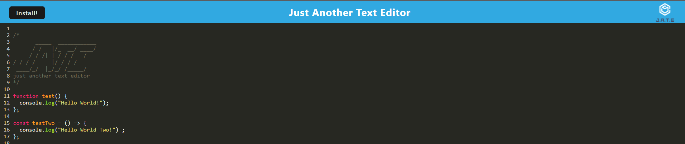

# JATE-Text-Editor
This application is a text editor that runs in the browser. It is a single-page application that meets the Progressive Web Application (PWA) criteria. Additionally, features a number of data persistence techniques that serve as redundancy in case one of the options is not supported by the browser. The application also functions offline.

## Table of Contents
- [Installation](#installation)
- [Usage](#usage)
- [Credits](#credits)
- [License](#license)
- [Badges](#badges)
- [Tests](#tests)
- [Questions](#questions)

## Installation
N/A

## Usage
You can use this application by clicking [here](https://lit-castle-67361-fccb0af3a0da.herokuapp.com/).  
Visiting the link above will open the application which looks like the following image:  
     
You can type any JavaScript you wish and when you click outside of the window, the changes will be saved to the indexedDB as well as local storage as a back up. This application will function offline and will sync to the database when the connection is restored. As a PWA, you can install the application to your device. Click on the install button and you will get a window prompt:  
     
Click on "install" and the app will install to your device. Any changes made to the application via the browswer or the installed app will update the database so the user can access all data on either platform. 

## Credits
Worked with mentor Jahn Swob on debugging registering the service worker as well as the getDb function.
Worked with tutor Jacob Nordan on caching.

## License
MIT License

## Badges

## Tests
N/A 

## Questions
GitHub Profile: [github.com/shannonkprice00](https://github.com/shannonkprice00) 
For further questions, you can reach me at shannonkprice00@gmail.com